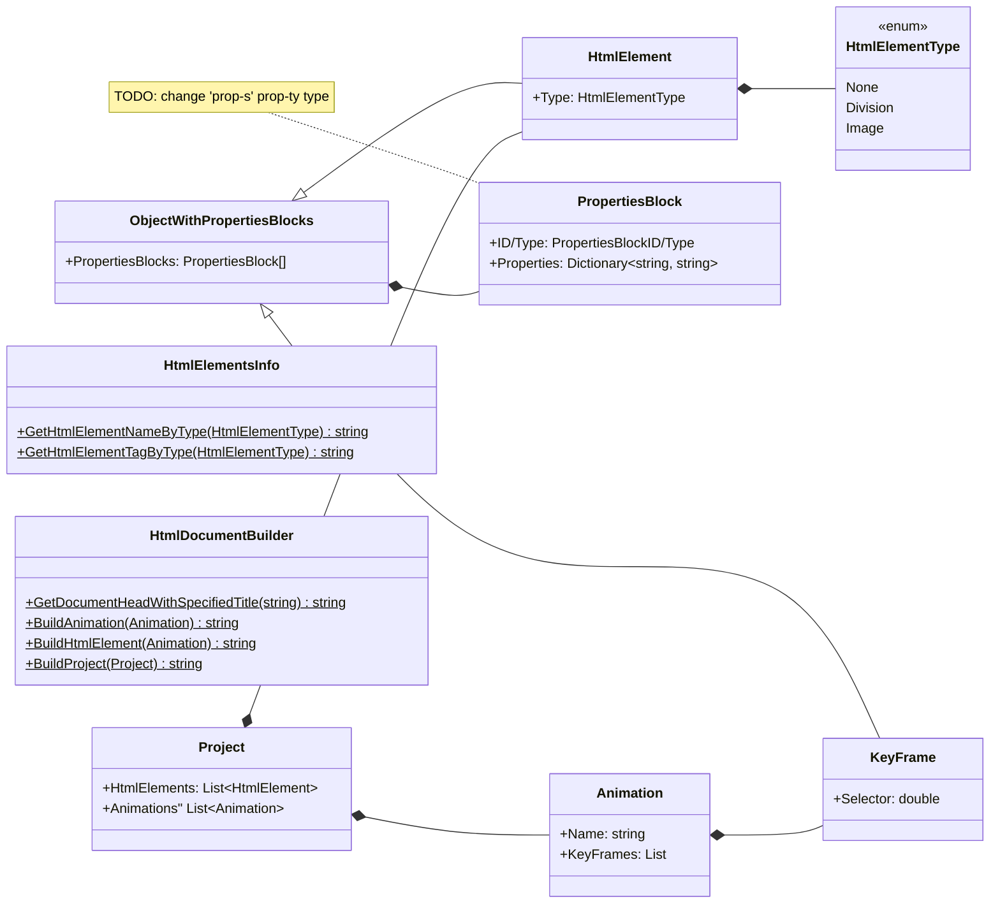

# Диаграмма классов

```mermaid
classDiagram
    direction LR
    class HtmlElement{
        +Type: HtmlElementType
    }
    class ObjectWithPropertiesBlocks{
        +PropertiesBlocks: PropertiesBlock[]
    }
    class PropertiesBlock{
        +ID/Type: PropertiesBlockID/Type
        +Properties: Dictionary~string, string~
    }
    class Animation{
        +Name: string
        +KeyFrames: List<KeyFrame>
    }
    class KeyFrame{
        +Selector: double
    }
    class Project{
        +HtmlElements: List~HtmlElement~
        +Animations" List~Animation~
    }
    class HtmlElementType{
        <<enum>>
        None
        Division
        Image
    }
    class HtmlElementsInfo{
        +GetHtmlElementNameByType(HtmlElementType) string$
        +GetHtmlElementTagByType(HtmlElementType) string$
    }
    class HtmlDocumentBuilder{
        +GetDocumentHeadWithSpecifiedTitle(string) string$
        +BuildAnimation(Animation) string$
        +BuildHtmlElement(Animation) string$
        +BuildProject(Project) string$
    }
    note for PropertiesBlock "TODO: change 'prop-s' prop-ty type"
    ObjectWithPropertiesBlocks<|--HtmlElement
    ObjectWithPropertiesBlocks<|--KeyFrame
    ObjectWithPropertiesBlocks*--PropertiesBlock
    Animation*--KeyFrame
    HtmlElement*--HtmlElementType
    Project*--HtmlElement
    Project*--Animation
```
