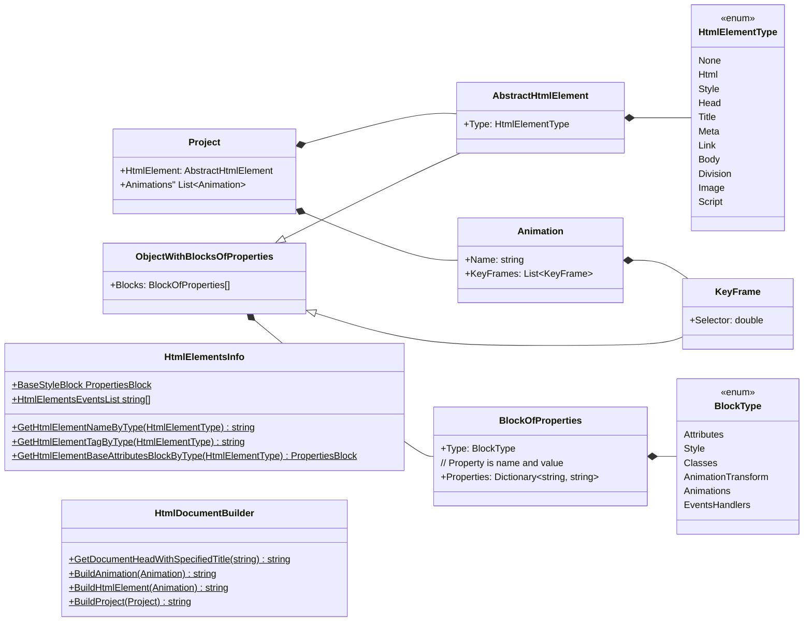

# Диаграмма классов

```mermaid
classDiagram
    direction LR
    class AbstractHtmlElement{
        +Type: HtmlElementType
    }
    class ObjectWithBlocksOfProperties{
        +Blocks: BlockOfProperties[]
    }
    class BlockOfProperties{
        +Type: BlockType
        // Property is name and value
        +Properties: Dictionary~string, string~
    }
    class Animation{
        +Name: string
        +KeyFrames: List~KeyFrame~
    }
    class KeyFrame{
        +Selector: double
    }
    class Project{
        +HtmlElement: AbstractHtmlElement
        +Animations" List~Animation~
    }
    class HtmlElementType{
        <<enum>>
        None
        Html
        Style        
        Head
        Title
        Meta
        Link
        Body
        Division
        Image
        Script
    }
    class BlockType{
        <<enum>>
        Attributes
        Style
        Classes
        AnimationTransform
        Animations
        EventsHandlers
    }
    class HtmlElementsInfo{
        +GetHtmlElementNameByType(HtmlElementType) string$
        +GetHtmlElementTagByType(HtmlElementType) string$
        +GetHtmlElementBaseAttributesBlockByType(HtmlElementType) PropertiesBlock$
        +BaseStyleBlock PropertiesBlock$
        +HtmlElementsEventsList string[]$
    }
    class HtmlDocumentBuilder{
        +GetDocumentHeadWithSpecifiedTitle(string) string$
        +BuildAnimation(Animation) string$
        +BuildHtmlElement(Animation) string$
        +BuildProject(Project) string$
    }
    ObjectWithBlocksOfProperties<|--AbstractHtmlElement
    ObjectWithBlocksOfProperties<|--KeyFrame
    ObjectWithBlocksOfProperties*--BlockOfProperties
    BlockOfProperties*--BlockType
    Animation*--KeyFrame
    AbstractHtmlElement*--HtmlElementType
    Project*--AbstractHtmlElement
    Project*--Animation
```
