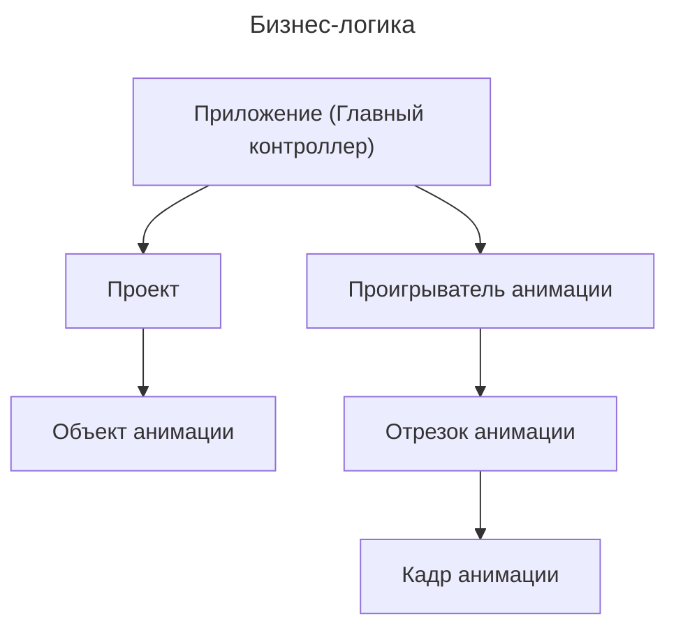
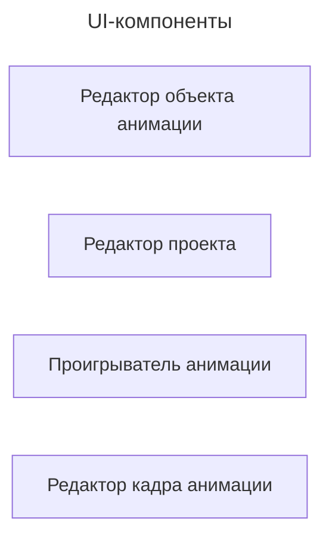
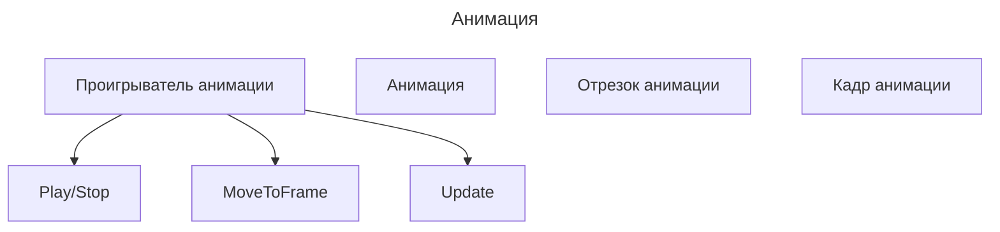

# WebAnimEdit / РедВебМульт

## Описание

Онлайн редактор мультипликации на основе HTML5.

## Архитектура проекта

### Бизнес-логика

### UI-компоненты

## Планы

### Оптимизация

- кеширование кадров

## Дополнительные материалы

[Ссылка на оставшуюся часть ВКР](https://github.com/NemoNology/Degree-work).
